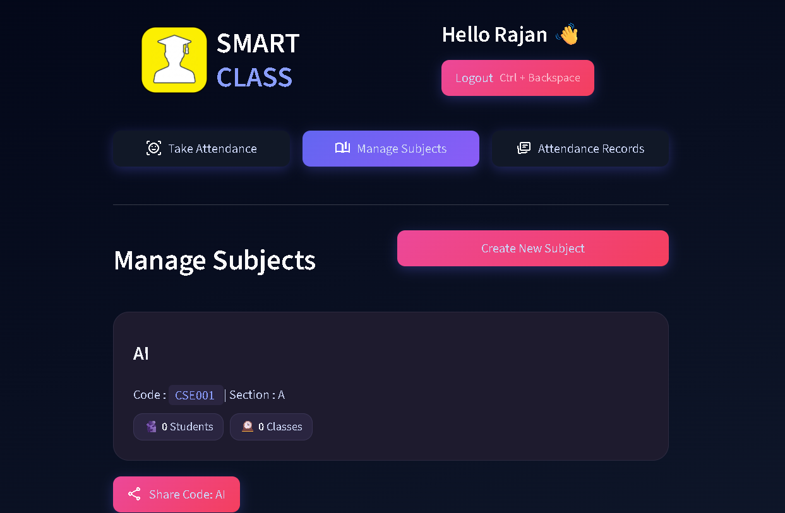

# 🎓 SmartClass AI – Intelligent Attendance & Classroom System

## 📌 Overview
SmartClass AI is an intelligent classroom management system built using **AI + Streamlit**.
It automates attendance, improves classroom efficiency, and provides a modern dashboard for both students and teachers.

The system leverages **face recognition, voice processing, and data analytics** to make attendance seamless and accurate.

---
- **Live Demo 💻:** https://smartclass-main.streamlit.app
---

## ✨ Features

### 👨‍🎓 Student Panel
* Face-based login authentication
* Real-time attendance marking
* Personal dashboard
* Attendance history tracking

### 👨‍🏫 Teacher Panel
* Secure login system
* Manage classes and students
* View attendance analytics
* Train face recognition model

### 🤖 AI Features
* Face Recognition (OpenCV / ML)
* Voice Embedding (optional module)
* Automated attendance logging
* Real-time prediction system

### 📊 Dashboard
* Clean UI built with Streamlit
* Interactive stats & analytics
* Class-wise insights

---

## 🛠️ Tech Stack

* **Frontend:** Streamlit
* **Backend:** Python
* **AI/ML:** OpenCV, NumPy, Scikit-learn,pandas
* **Database:** Supabase
* **Deployment:** Streamlit Cloud

---

## 🧠 How It Works

1. User logs in (Student / Teacher)
2. System captures face data
3. Face embeddings are generated
4. ML model predicts identity
5. Attendance is marked automatically
6. Data is stored and displayed in dashboard
---

## 📸 Screenshots

### 🔹 Home Page


### 🔹 Teacher Dashboard



---

## 📂 Project Structure

```
smartclass-ai/
│── app.py
│── src/
│   ├── components/
│   ├── pipelines/
│   ├── database/
│   └── ui/
│── models/
│── screenshots/
│── requirements.txt
│── README.md
```
---

## 🔐 Future Improvements

* 🔹 Cloud database integration
* 🔹 Mobile app version
* 🔹 Emotion detection (AI classroom analytics)
* 🔹 Role-based access improvements
* 🔹 Attendance export (PDF/Excel)

---

## 🤝 Contributing

Contributions are welcome!

1. Fork the repo
2. Create a new branch
3. Commit your changes
4. Submit a PR

---

## 👨‍💻 Author

**Ankit Gupta**
---

## ⭐ Support
If you like this project, give it a ⭐ on GitHub!
